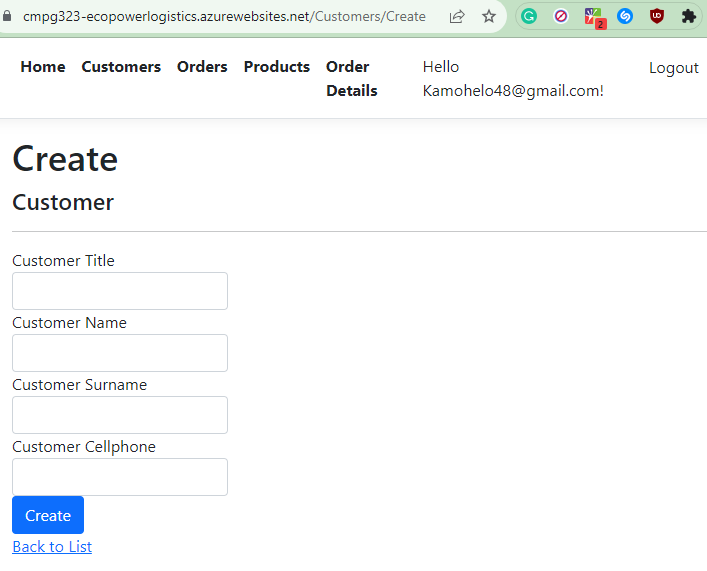

# CMPG323-Project4-31967000

## Introduction
Project 4 is about Robotic Process Automation(RPA). It uses the same logic as human beings if they were to execute a process. 

## How the project works
The system is very simple to run. We have an excel file that contains data inside of it, the system must create, read, update and delete the data in the online database. 
Below are the steps of how the automation will occur:

### 1. The user will have an option to either Register or Login. Say that the user logs in, They will be greated by a welcome page that has the following navigation links (register or loging). The automation will click on Login and lead to another page. 
