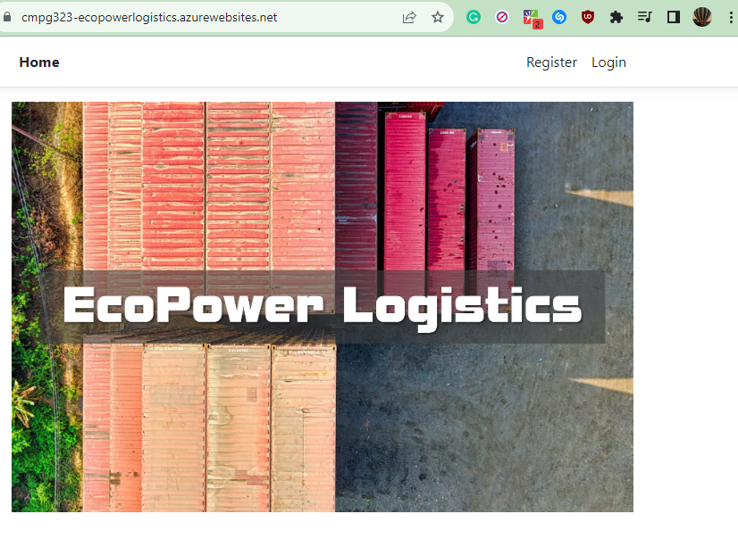
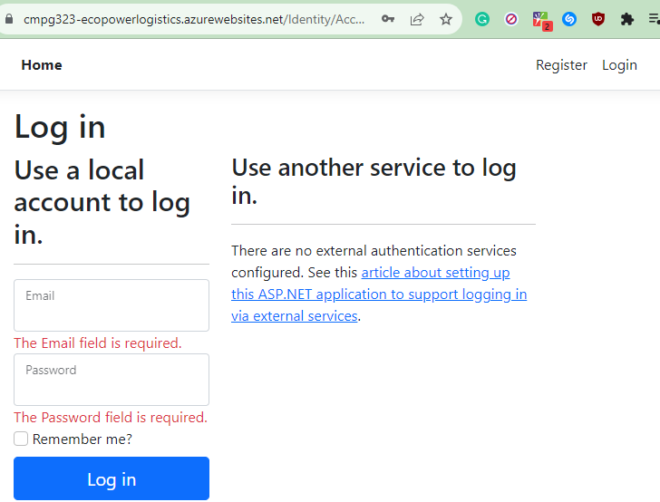
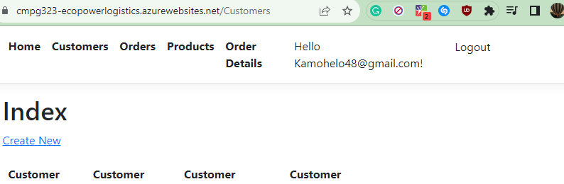
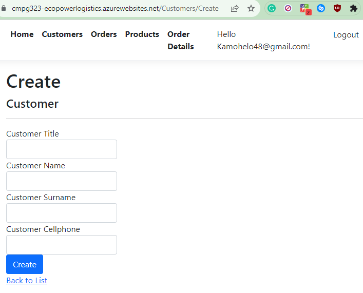
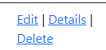

# CMPG323-Project4-31967000

## Introduction
Project 4 is about Robotic Process Automation(RPA). It uses the same logic as human beings if they were to execute a process. 

## How the project works
The system is very simple to run. We have an excel file that contains data inside of it, the system must create, read, update and delete the data in the online database. 
Below are the steps of how the automation will occur:

### 1. The user will have an option to either Register or Login. Say that the user logs in, They will be greated by a welcome page that has the following navigation links (register or login). The user will click on Login and lead to another page. 

### 2. Once the user has clicked the login navigation link, the user will be redirected to the Log in page where they will be requested to fill in their Email and Password then eventually click the Log in button.
 

 ### 3. Once the user logs in they can Click on any of the Navigations links(Customers, Orders, Products or Order Details). Say the Customer clicks on the Customers Nav link they will be sent to the customers page where they must create and insert data. The user must click on Create New to be able to fill in their data. 
 

 #### 4. Now the user is in progress of entering data they will come across empty fields as displayed below once they are done they click on the Create button:
  

  ### 5. The user can choose to either Edit or delete their entries in the customers table: 
  

  ### 6. The user can perform the above actions for the rest of the tables availble.

  ## Reference List
  Below are Project 4 References

  1. RPA Hub (2023). Calendar Picker Example using UiPath | UiPath Tutorial | uipath. [online] Available at: https://www.youtube.com/watch?v=Y3jHPvFpyqY&t=84s [Accessed 19 Oct. 2023].
  2. Let's Automate (2022). Automate Date Picker With UiPath | Learn RPA. [online] www.youtube.com. Available at: https://www.youtube.com/watch?v=PwiYmwF6oyo&t=37s [Accessed 19 Oct. 2023].
  3. Uipath.com. (2023). StudioX User Guide. [online] Available at: https://docs.uipath.com/studiox/standalone/2023.4/user-guide/excel-automation [Accessed 15 Oct. 2023].
  4. Kala, M. (2022). Excel Automation Tips and Tricks | Community Blog. [online] www.uipath.com. Available at: https://www.uipath.com/community-blog/tutorials/excel-automation-tips-and-tricks#:~:text=With%20UiPath%20Excel%20Automation%2C%20manipulating [Accessed 18 Oct. 2023].
  5. Hamilton, T. (2023). UiPath Tutorial for Beginners: What is UiPath RPA? Features. [online] www.guru99.com. Available at: https://www.guru99.com/uipath-tutorial.html.
  6. Kansara, A. (2019). Excel Automation with RPA - Excel Application RPA | UiPath. [online] www.uipath.com. Available at: https://www.uipath.com/community-blog/tutorials/excel-automation-application-rpa [Accessed 17 Oct. 2023].
  7. Kala, M. (2021). Start UiPath Excel Automation | Excel Activities | Project Scenarios | Examples | Tips &Tricks | RPA. [online] www.youtube.com. Available at: https://www.youtube.com/watch?v=QxzOhw43TwY [Accessed 14 Oct. 2023].
  8. Edureka (2021). RPA Projects in 60 Minutes | Automation Anywhere | Real-Life RPA Projects | Edureka | RPA Live - 1. [online] www.youtube.com. Available at: https://www.youtube.com/watch?v=0UJnk-bVgNg [Accessed 19 Oct. 2023].
  9. uipath (2023). Data Service Automation Cloud User Guide. [online] Uipath.com. Available at: https://docs.uipath.com/data-service/automation-cloud/latest/user-guide/date-time [Accessed 14 Oct. 2023].
  10. Moorthy, K. (2022). How to Click Element if we have other duplicate id’s. [online] UiPath Community Forum. Available at: https://forum.uipath.com/t/how-to-click-element-if-we-have-other-duplicate-ids/481528 [Accessed 15 Oct. 2023].
‌

